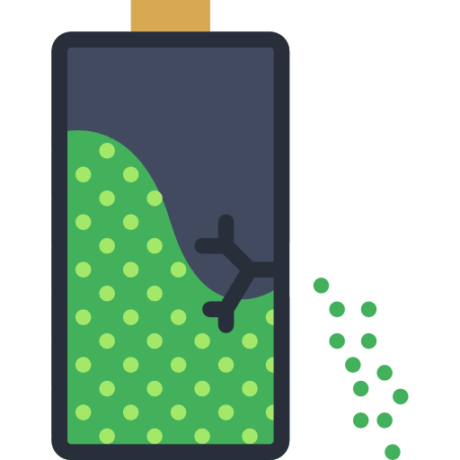

<div id="top"></div>
<!-- PROJECT LOGO -->
<br />
<div align="center">
  <a href="https://github.com/Mhackiori/Leaky-Batteries">
    
  </a>

  <h1 align="center">Leaky Batteries</h1>

  <p align="center">
    A Novel Set of Side-Channel Attacks on Electric Vehicles
    <br />
    <a href="https://github.com/Mhackiori/Leaky-Batteries"><strong>Paper in progress »</strong></a>
    <br />
    <br />
    <a href="https://github.com/Mhackiori/Leaky-Batteries">Anonymous Authors</a>
  </p>
</div>

<!-- TABLE OF CONTENTS -->
<details>
  <summary><strong>Table of Contents</strong></summary>
  <ol>
    <li>
      <a href="#abstract">Abstract</a>
    </li>
    <li>
      <a href="#usage">Usage</a>
    </li>
  </ol>
</details>

<div id="abstract"></div>

## 🧩 Abstract

>Advancements in battery technology have accelerated the adoption of Electric Vehicles (EVs) due to their environmental benefits. However, their growing sophistication introduces security and privacy challenges. Often seen as mere operational data, battery consumption patterns can unintentionally reveal critical information exploitable for malicious purposes. These risks go beyond privacy, impacting vehicle security and regulatory compliance. Despite these concerns, current research has largely overlooked the broader implications of battery data exposure. As EVs integrate further into smart transportation networks, addressing these gaps is crucial to ensure their safety, reliability, and resilience. In this work, we introduce a novel class of side-channel attacks that exploit EV battery data to extract sensitive user information. Leveraging only battery consumption patterns, we demonstrate a methodology to accurately identify the EV driver and their driving style, determine the number of occupants, and infer the vehicle's start and end locations when user habits are known. We utilize several machine learning models and feature extraction techniques to analyze EV power consumption patterns, validating our approach on simulated and real-world datasets collected from actual drivers. Our attacks achieve an average success rate of 95.4% across all attack objectives. Our findings highlight the privacy risks associated with EV battery data, emphasizing the need for stronger protections to safeguard user privacy and vehicle security.

<p align="right"><a href="#top">(back to top)</a></p>
<div id="usage"></div>

## ⚙️ Usage

Start by cloning the repository.

```bash
git clone https://github.com/Mhackiori/Leaky-Batteries.git
cd Leaky-Batteries
```

Then, install the required Python packages by running the following command. We reccomend setting up a dedicated environment to run the experiments.

```bash
pip install -r requirements.txt
```

<p align="right"><a href="#top">(back to top)</a></p>